# Symphony 业务逻辑说明

这份文档用“对外讲解 / PPT 讲稿”的方式说明 Symphony 的业务逻辑。它不假设读者懂 Elixir、OTP 或 Codex app-server，只把系统里的人、工作、资源和状态如何流动讲清楚。

## 1. 一句话说明

Symphony 是一个“自动派工和监督执行”的服务。

它会持续观察 Linear 项目里的任务，把合适的任务分配给 Codex，在独立工作区里执行；如果任务还没完成，就继续让 Codex 做；如果任务结束、被取消、进入人工审核或出错，就按规则停止、重试或交回给人。

可以把它想成一个项目助理：

- 人负责定义目标、维护 Linear 状态、审核结果。
- Symphony 负责盯任务池、分配任务、控制并发、记录运行状态。
- Codex 负责在一个隔离的代码工作区里真正干活。
- Linear 是任务和进度的共享看板。

## 2. 这是什么模式：目标导向 + 事件驱动

Symphony 不是一次性脚本，也不是传统审批流。它更像一个“目标导向的事件循环”。

### 目标导向

目标来自 Linear issue。每个 issue 都是一份要完成的工作目标，包括标题、描述、状态、优先级、标签、阻塞关系等。

Symphony 不直接理解业务产品需求本身，它只理解“这个 issue 是否应该交给 Codex 执行，以及执行到什么阶段应该停止或继续”。

### 事件驱动

系统会被这些事件推动：

- 定时轮询到了。
- 有人点了 dashboard/API refresh。
- Linear issue 状态变化了。
- Codex turn 完成、失败、超时或卡住了。
- retry timer 到点了。
- `WORKFLOW.md` 配置文件改了。
- 服务启动或关闭了。

所以它的核心不是“从 A 一路跑到 Z”，而是不断回答三个问题：

1. 现在有哪些任务值得启动？
2. 正在跑的任务还该继续吗？
3. 出错、卡住、状态变化时该释放、重试还是清理？

## 3. 人、物、资源分别是什么

### 人

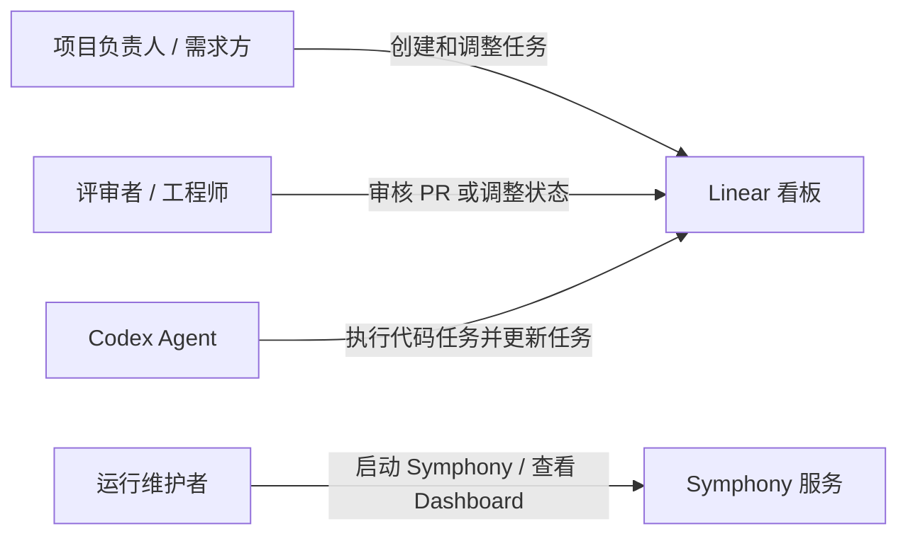

人在系统中的角色很清楚：

- 项目负责人把目标放到 Linear。
- 评审者通过状态和 PR 反馈控制是否继续。
- 运行维护者启动 Symphony、查看状态、处理权限或环境问题。
- Codex 是“执行者”，但它也会通过工具读写 Linear。

### 物

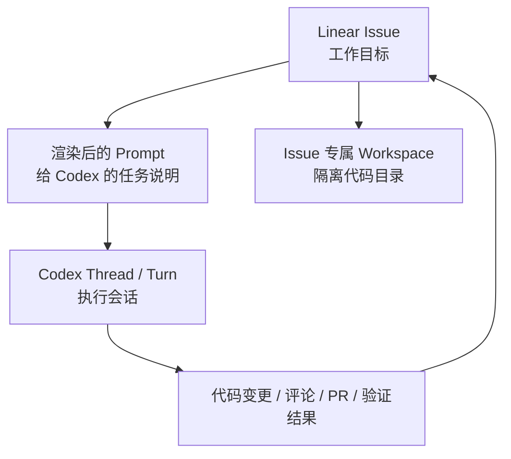

这里的“物”主要是业务对象：

- `Issue`：工作目标。
- `Workflow`：团队如何执行任务的规则。
- `Workspace`：每个 issue 的独立工作场地。
- `Run Attempt`：一次执行尝试。
- `Live Session`：Codex 的线程和 turn。
- `Retry Entry`：失败或继续执行时排队的重试记录。

### 资源

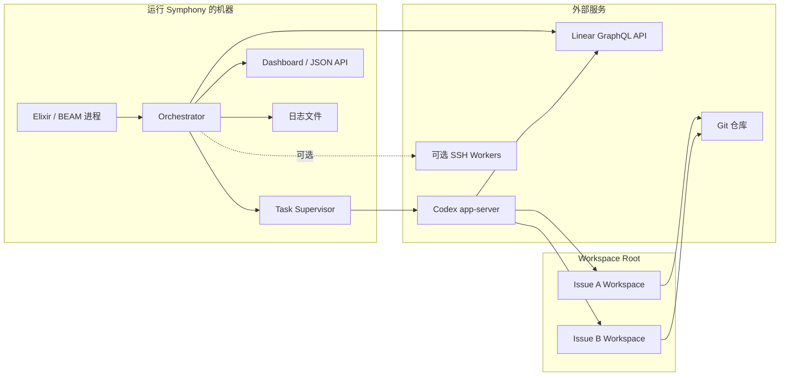

资源流动的核心规则：

- Codex 只能在某个 issue 的 workspace 中运行，不能直接在源仓库根目录乱跑。
- workspace 会复用，方便失败后继续当前进度。
- terminal issue 的 workspace 会被清理。
- 并发受 `agent.max_concurrent_agents` 和按状态的并发上限控制。
- 可选 SSH worker 可以把执行分散到远程机器。

## 4. 全局业务闭环

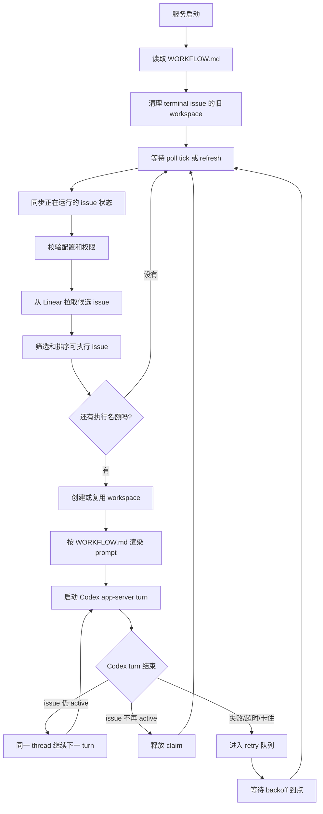

这张图可以理解为 Symphony 的“心跳”：

- 每次心跳先看正在跑的任务是否还该跑。
- 再看有没有新任务可以启动。
- 启动后由 Codex 执行。
- 执行完不代表结束，必须回头看 Linear 状态。
- 只要目标还处于 active 状态，就继续推进。

## 5. 何时开始，何时结束

### 服务什么时候开始

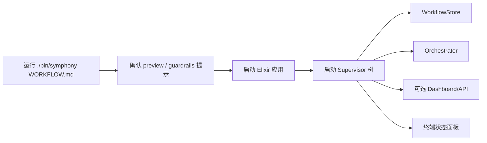

服务启动需要一个 `WORKFLOW.md`。这个文件既是配置，也是“给 Codex 的工作说明书”。

启动后，Symphony 会：

1. 读取 workflow。
2. 校验配置。
3. 清理已经 terminal 的旧工作区。
4. 安排第一次 poll tick。

### 单个 issue 什么时候开始

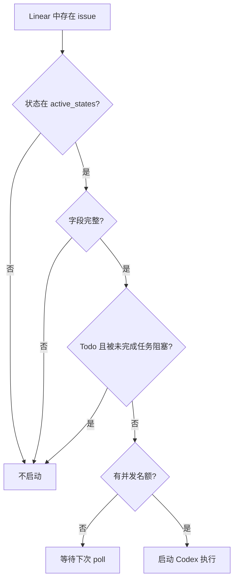

默认 active states 通常是：

- `Todo`
- `In Progress`

当前 repo 的示例 `WORKFLOW.md` 还把这些状态放进 active states：

- `Merging`
- `Rework`

### 单个 issue 什么时候结束

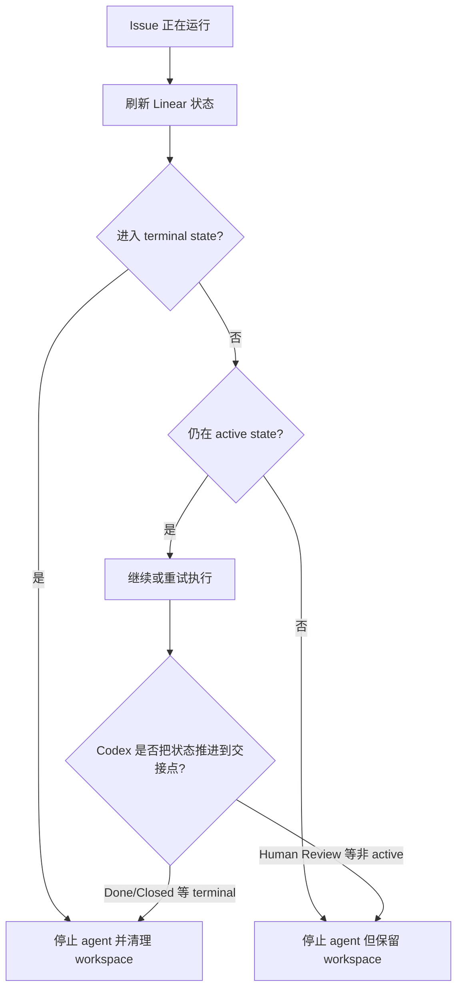

结束有几种含义：

- 对 Symphony 来说：issue 不再需要当前 agent 执行，就结束这次运行。
- 对 workspace 来说：只有 terminal issue 才会清理 workspace。
- 对业务流程来说：可能结束在 `Human Review`，也可能结束在 `Done`。

这点很重要：Symphony 的成功不一定等于 issue 进入 `Done`。如果 workflow 设计要求人工审核，那么进入 `Human Review` 也是一次正常交接。

## 6. 触发器总表

| 触发器 | 谁触发 | 发生时做什么 | 结果 |
|---|---|---|---|
| 服务启动 | 运维者 / CLI | 读取 workflow、启动 supervisor、安排 tick | Symphony 开始工作 |
| poll tick | Orchestrator 定时器 | reconcile、fetch、dispatch | 启动新 agent 或继续等待 |
| 手动 refresh | Dashboard / API | 立即安排一次 poll/reconcile | 更快看到新任务或状态变化 |
| Workflow 文件变化 | WorkflowStore | 重新加载配置和 prompt | 未来的调度和 prompt 使用新规则 |
| Linear 状态变化 | 人或 Codex | 下次 reconcile 时被发现 | 继续、停止或清理 |
| Codex turn completed | Codex app-server | 刷新 issue 状态 | active 则继续，不 active 则释放 |
| Codex failed/cancelled/timeout | Codex app-server | 记录失败并排 retry | 按 backoff 重新尝试 |
| stall timeout | Orchestrator | 杀掉长时间无活动 worker | 排 retry |
| retry timer 到点 | Orchestrator | 重新拉取候选 issue | 仍 eligible 则重新 dispatch |
| terminal cleanup | 服务启动或 active reconcile | 删除 terminal issue workspace | 回收资源 |

## 7. Issue 状态如何影响执行

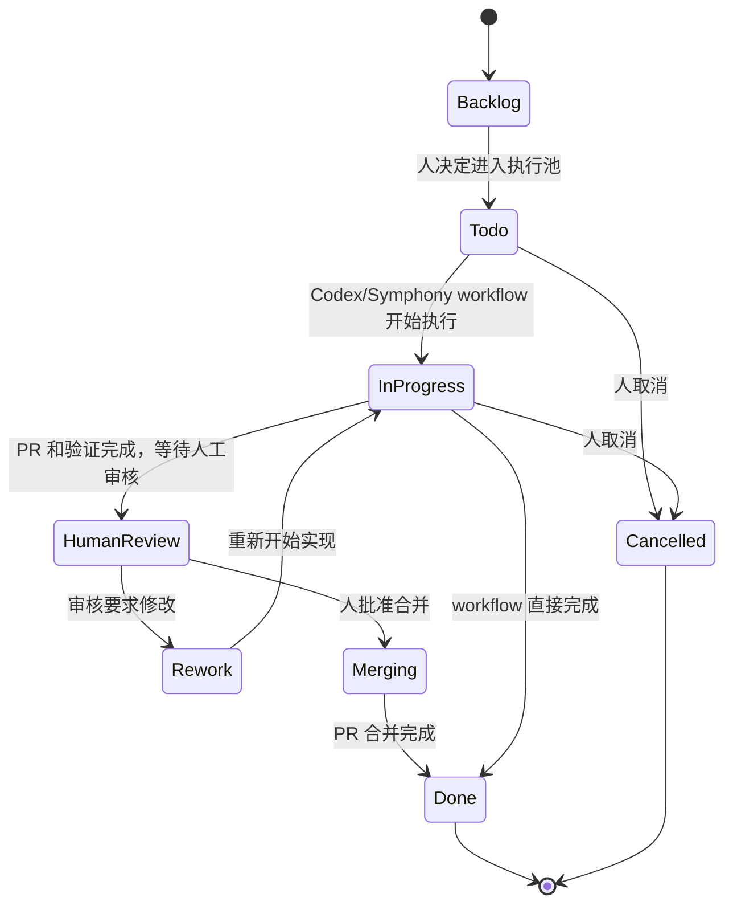

这张图是“业务状态图”，不是代码里的 GenServer 状态图。

Symphony 只会处理 active states 里的 issue。其他状态通常意味着：

- `Backlog`：还没准备好，不碰。
- `Human Review`：等人，不继续写代码。
- `Done / Closed / Cancelled / Duplicate`：终态，清理或忽略。

## 8. Orchestrator 内部怎么管任务

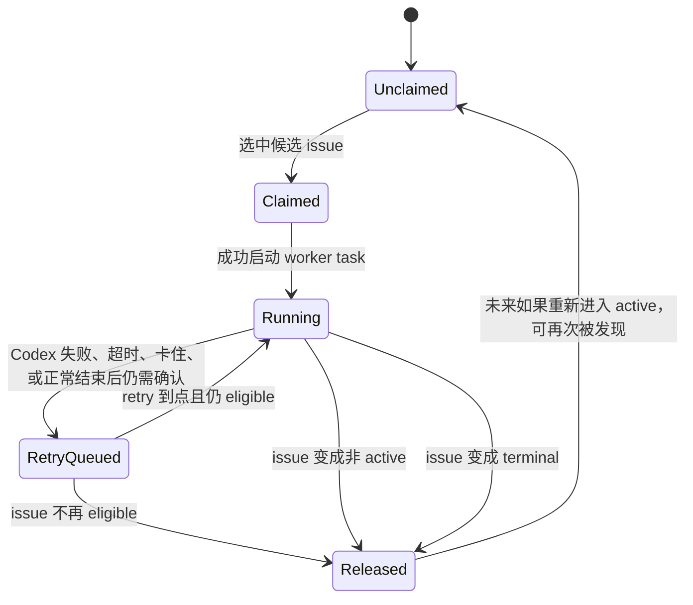

内部 claim 机制的目的很简单：防止同一个 issue 被重复派给多个 Codex。

## 9. 一次 Codex 执行的细节

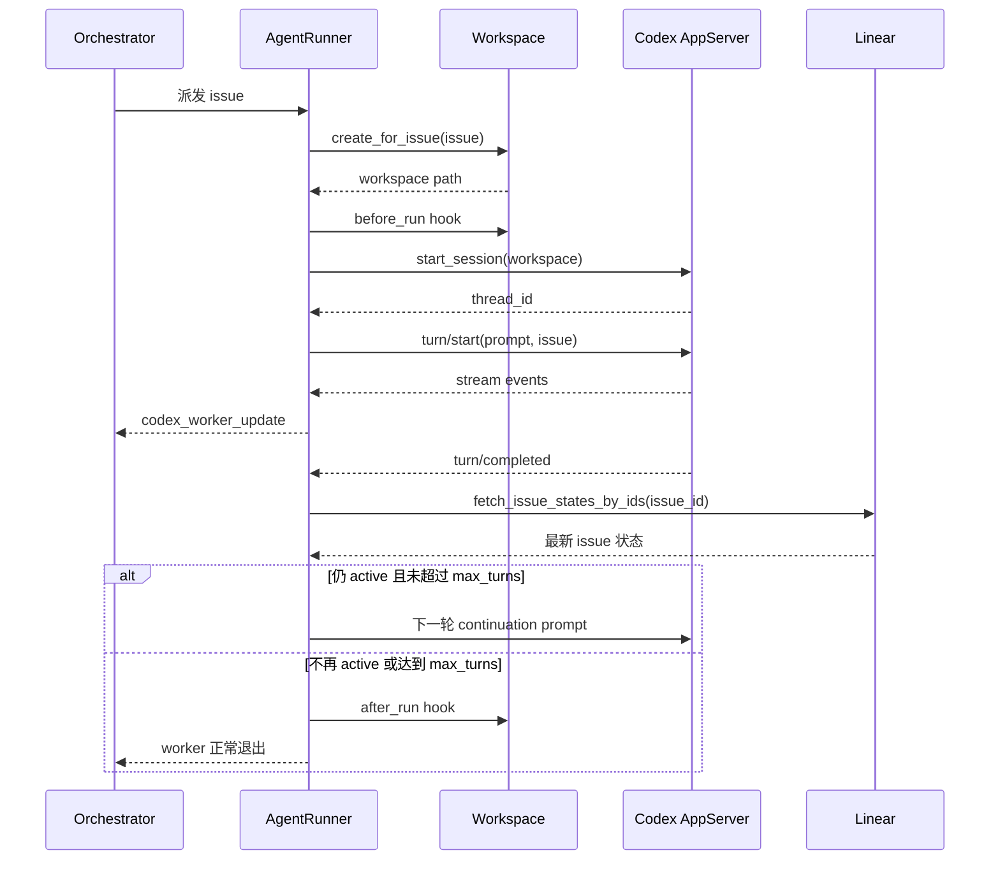

Codex 的第一轮会收到完整 issue prompt。后续 continuation turn 不重复完整 prompt，只提醒它“继续当前任务、从已有 workspace 和 workpad 接着做”。

## 10. 实体关系图

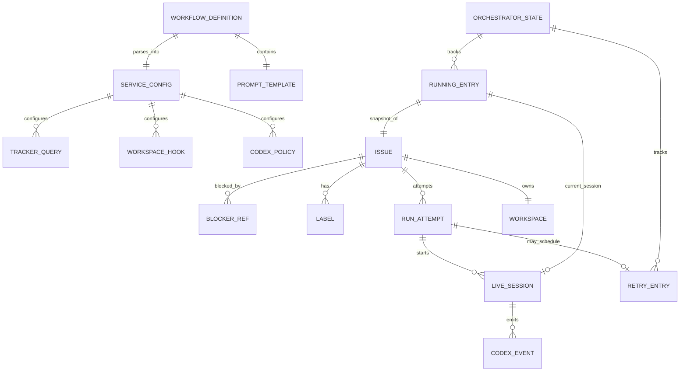

可以把实体分成三类：

- 配置类：`WORKFLOW_DEFINITION`、`SERVICE_CONFIG`、`PROMPT_TEMPLATE`。
- 业务类：`ISSUE`、`WORKSPACE`、`RUN_ATTEMPT`、`LIVE_SESSION`。
- 调度类：`ORCHESTRATOR_STATE`、`RUNNING_ENTRY`、`RETRY_ENTRY`。

## 11. 资源关系图

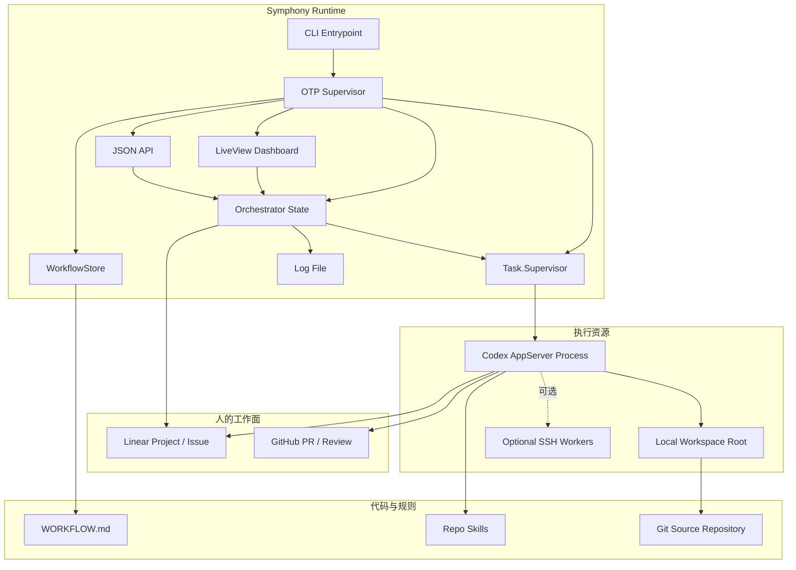

这张图说明资源边界：

- Linear 和 GitHub 是人的协作面。
- Symphony runtime 是自动调度面。
- Workspace / Codex / SSH worker 是执行面。
- `WORKFLOW.md` 和 skills 是团队规则面。

## 12. 三个循环

Symphony 里最关键的是三个循环。

### 循环一：任务池循环

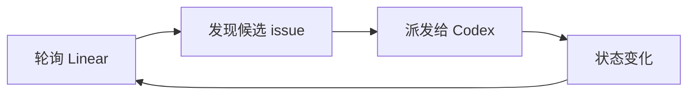

这个循环回答：“下一批谁该开工？”

### 循环二：单任务执行循环

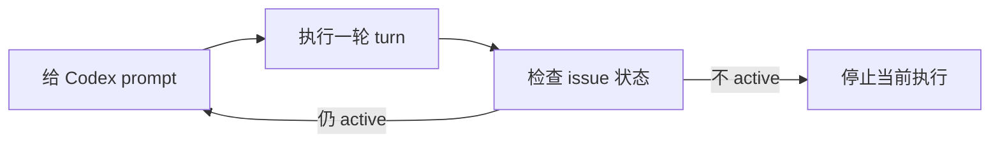

这个循环回答：“这个任务做完了吗？还要不要接着做？”

### 循环三：失败恢复循环

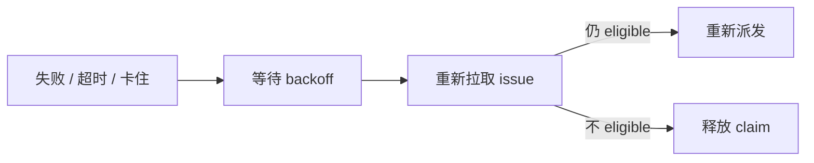

这个循环回答：“出问题后，是重试还是放手？”

## 13. 用通俗比喻理解

可以把 Symphony 想成一家小工厂：

- Linear 是订单板。
- Issue 是订单。
- `WORKFLOW.md` 是作业指导书。
- Orchestrator 是调度员。
- Workspace 是每张订单的独立工位。
- Codex 是工人。
- Dashboard 和日志是监控大屏。
- Retry queue 是返工排队区。

调度员不直接加工产品，只负责：

1. 看订单板。
2. 判断订单是否能开工。
3. 分配工位和工人。
4. 盯着工人有没有卡住。
5. 订单变成完成、取消或人工审核时，收回工位或暂停执行。

## 14. 对外讲解时可以这样说

第一页：

Symphony 把 Linear 里的任务变成 Codex 的无人值守执行流。它不是替代项目管理，而是把“谁该执行、在哪里执行、失败怎么办、何时停手”自动化。

第二页：

系统采用目标导向。目标来自 issue，执行规则来自 `WORKFLOW.md`，执行资源是 per-issue workspace 和 Codex app-server。

第三页：

系统采用事件驱动。定时 poll、手动 refresh、issue 状态变化、Codex 事件、retry timer、workflow reload 都会推动下一步决策。

第四页：

结束不是单一的。对 Codex 来说，turn 完成只是一个检查点；对 Symphony 来说，issue 离开 active states 就会停手；对业务来说，可能进入 Human Review，也可能进入 Done。

第五页：

安全边界是 workspace。每个 issue 只能在自己的工作区执行，terminal issue 会清理工作区，running 和 claimed 防止重复派工。

## 15. 代码阅读路线

如果后面要继续深挖代码，建议按这个顺序读：

1. `elixir/WORKFLOW.md`：先看团队希望 Codex 怎么干活。
2. `elixir/lib/symphony_elixir/orchestrator.ex`：看任务如何被选择、派发、重试、停止。
3. `elixir/lib/symphony_elixir/agent_runner.ex`：看单个 issue 如何连续执行多个 Codex turn。
4. `elixir/lib/symphony_elixir/workspace.ex`：看 workspace 如何创建、复用、清理和保证安全。
5. `elixir/lib/symphony_elixir/linear/client.ex`：看 Linear issue 如何被拉取和正归一化。
6. `elixir/lib/symphony_elixir/codex/app_server.ex`：看 Codex app-server 协议、事件、approval 和 tool call 如何处理。
7. `elixir/lib/symphony_elixir_web/router.ex` 和相关 controller/liveview：看 dashboard 与 JSON API。

## 16. 总结

Symphony 的业务逻辑可以压缩成一句话：

> 用 Linear issue 作为目标，用 `WORKFLOW.md` 作为规则，用 workspace 作为安全执行边界，用 Codex app-server 作为执行者，再由 Orchestrator 通过轮询、状态同步、并发控制和重试机制把工作循环推进。

最需要记住的三件事：

- 它是目标导向的：目标来自 issue。
- 它是事件驱动的：每次 tick、状态变化、Codex 事件都会触发新判断。
- 它是循环推进的：不是跑一次就结束，而是持续检查、继续、停止或重试。
